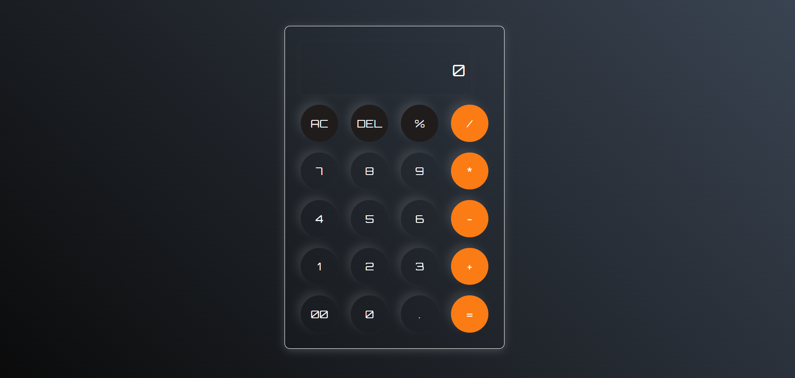

# 🔢 Calculator App

This is a **simple and stylish calculator** built using **HTML, CSS, and JavaScript**. It performs basic arithmetic operations and includes interactive button styling and keyboard-like interface design.

## 🚀 Live Preview

[👉 Click here to see the live demo] (#https://akhils0ni.github.io/calculator/)  

---

## ✨ Features

- Responsive and modern UI design
- Basic arithmetic: `+`, `-`, `*`, `/`, `%`
- Clear (`AC`) and Delete (`DEL`) functionality
- Handles multi-digit input and decimal values
- Built with:
  - 💡 HTML for structure
  - 🎨 CSS for styling (Orbitron font + glassmorphism design)
  - 🧠 JavaScript for logic

---
## 🖼️ Screenshot

